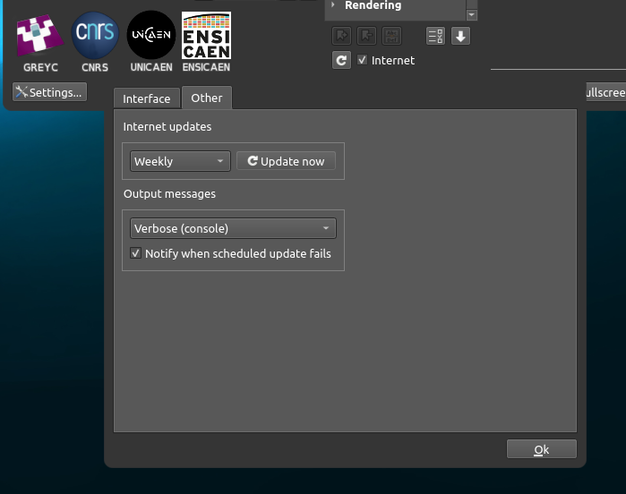
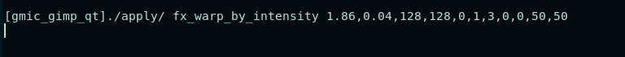

### A simple bash script that uses GMIC-cli and ffmpeg to add a GMIC filter to frames of a video.
#### Used to make cool glitchart/effects
 

## Using different effects
### (You will need GIMP and the GMIC-GIMP plugin for this)
Enable verbose console logging in GMIC's settings

Then launch GIMP using the command line using a screenshot of the video you want to edit or whatever you want.
Open the GMIC dialogue under "filter"
Set up whatever effect you'd like
GMIC will log the effect and parameters after you click "ok"

Copy and paste your effect + parameters into run.sh as the value of "EFFECT"
